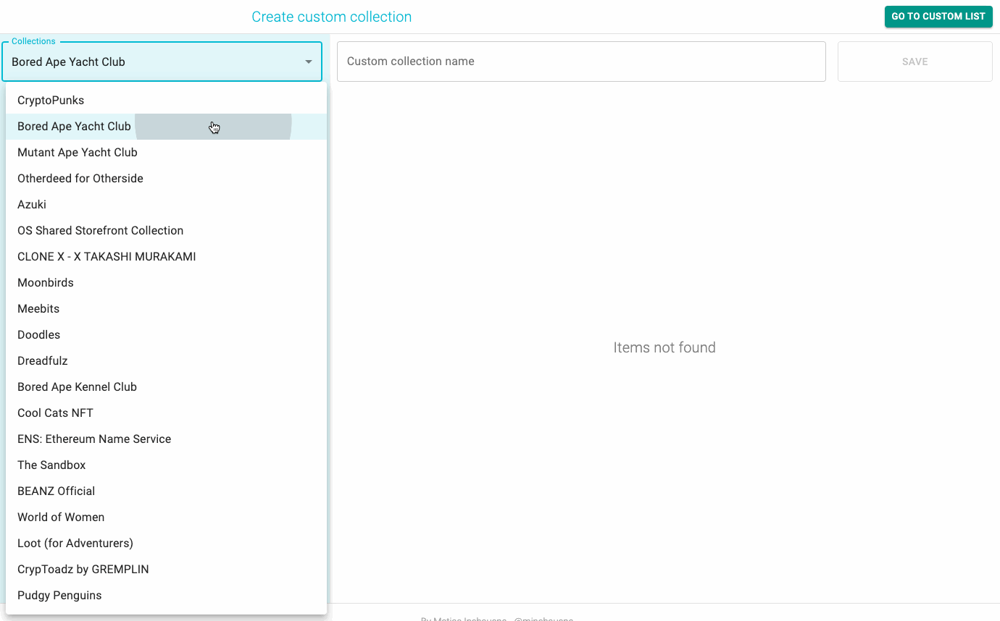

# NFT-list

## Overview

The functionality responds to the user being able to create their own custom collections of tokens.
First we have a list of collections that derive from the [Reservoir API](https://docs.reservoir.tools/reference/overview), the user will choose the collections and go choosing and adding the tokens that you prefer to your collection. It must have a valid collection name (!empty) to be able to save it in the user list (persisted).
The user can also edit their collections of tokens and delete them too.

## Let's run

> 1. Clone the repo.
> 2. Create a `.env` file and add `https://api.reservoir.tools` as a `VITE_APP_API_URL` (view `.env.sample`).
> 3. `npm i` in the project directory
> 4. `npm run dev` in the project directory

Run the test: `npm test` or `npm run test:ci` to view the coverage

---

## Notes

In terms of design, this is something I usually use in small projects in terms of folder architecture. Although the business model is detached from the responsibility of the components I have not used CLEAN architecture.
In this case I tried to respect some of the SOLID concepts and make the app scalable.
It is largely hook oriented, using a data fetching library for API calls and Context API.

_TO CONSIDER:_ For testing were only added testing of components - and not were completed for time reasons

---

## Preview

